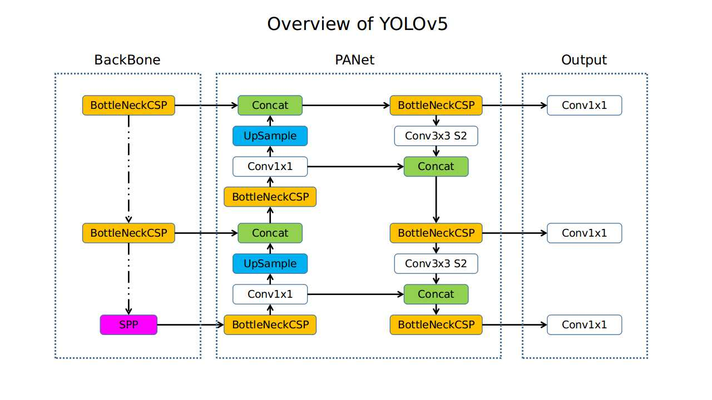

  

# IntelliInfer

The IntelliInfer project, developed for the Advanced Programming exam at the Polytechnic University of the Marche (UNIVPM) during the academic year 2023-2024, represents an advanced API for managing datasets and executing inferences based on artificial intelligence models. This project was conceived to facilitate interaction with data and leverage the power of artificial intelligence to extract meaningful information from it. It was developed during the Master's degree program in Computer Engineering and Automation.

# Project Goal

The main goal of IntelliInfer is to provide an API for loading datasets, managing them, and using AI models to perform inference. Users can upload their datasets and utilize the available models to make predictions on new data.

# Design

## Rotte

| Auth | Function                                          | Role  |
|-----|---------------------------------------------------|--------|
| Yes | recharge user credit                              | admin  |
| Yes | update neural network model weights               | admin  |
| Yes | list neural networks’ models                      | user   |
| Yes | show a specific neural network’s model            | user   |
| Yes | create a new dataset                              | user   |
| Yes | delete a dataset                                  | user   |
| Yes | list all datasets                                 | user   |
| Yes | show a specific dataset                           | user   |
| Yes | update a dataset                                  | user   |
| Yes | upload a file on a dataset                        | user   |
| Yes | perform inference operation                       | user   |
| Yes | check the state of the current inference operation| user   |
| Yes | show inference results                            | user   |
| Yes | check user’s remaining credit                     | user   |
| Yes | save inference results                            | system |
| No  | generate auth token                               | all    |
| No  | check if the service is online                    | all    |

| Type  | Route                                            |
|-------|--------------------------------------------------|
| PUT   | /credit/recharge/:userId                         |
| PUT   | /model/:aiId/change/weights                      |
| GET   | /model/list                                      |
| GET   | /model/:modelId                                  |
| GET   | /dataset/list                                    |
| GET   | /dataset/:datasetId                              |
| POST  | /dataset/create                                  |
| PUT   | /dataset/:datasetId/update                       |
| DELETE| /dataset/:datasetId/delete                       |
| POST  | /dataset/:datasetId/upload  (zip & img)          |
| POST  | /inference/:datasetId/:aiId/                     |
| GET   | /inference/state/:resultId                       |
| GET   | /inference/result/:resultId                      |
| POST  | /inference/result/:resultId  (callback)          |
| GET   | /generate/token/:userId                          |
| GET   | /check/health                                    |

## Uses Case Diagram

  

# db design

## ER Schema

  

## Database Schema

  

# Proposed Neural Network Models

## Overview
In our application, users are able to perform inference on a variety of image datasets using different artificial intelligence models and various weight combinations. Specifically, they can execute inference on a YOLOv5 architecture and on a Faster RCNN. Furthermore, considering the possibility of having multiple models, we have introduced also a simulator of inference.

## YOLOv5
YOLOv5 is an object detection model that builds upon the success of its predecessors. Developed by Ultralytics, YOLOv5 offers significant advancements in speed and accuracy compared to previous versions. It employs a single neural network to detect objects within images or video frames in real-time, providing bounding box coordinates and class probabilities for each detected object. YOLOv5 is highly versatile, capable of detecting a wide range of objects across various environments with remarkable efficiency.

  

What we did to implement inference on YOLOv5 in our project was to train a pre-existing architecture on a high-resolution SAR satellite image dataset. Subsequently, we saved the weights with which the user has the option to test this functionality, retrieving them from the database, and we implemented the script to perform inference on an architecture we imported. You can find it at the following link: https://github.com/jasonmanesis/Ship-Detection-on-Remote-Sensing-Synthetic-Aperture-Radar-Data.

  

## Faster RCNN
Also the Faster RCNN (Region-based Convolutional Neural Network) is a deep learning model widely used for object detection tasks. It represents a significant advancement over previous R-CNN architectures by integrating region proposal networks (RPNs) directly into the network architecture, enabling end-to-end training. Faster R-CNN achieves impressive accuracy and efficiency by leveraging convolutional neural networks (CNNs) to extract features from an input image and using the RPN to propose candidate object bounding boxes. These proposals are then refined and classified by subsequent layers in the network, resulting in precise object detection with reduced computational overhead. Faster R-CNN has become a popular choice for various applications, including autonomous driving, surveillance, and image understanding tasks.

  

To implement inference on this architecture in our project, we relied on the resources found in the following GitHub repository: https://github.com/litcoderr/faster-rcnn-inference/blob/main/docker/Dockerfile

